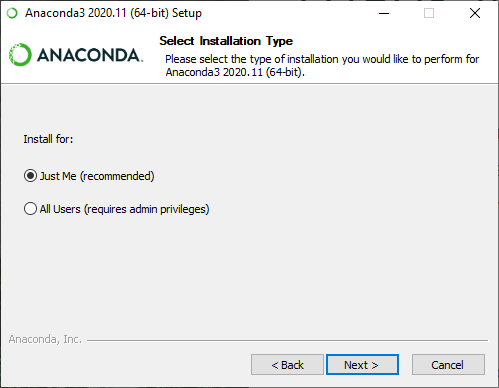
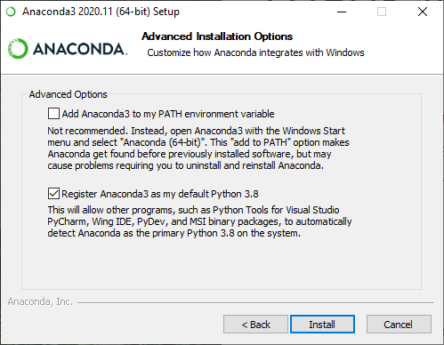
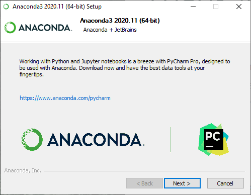
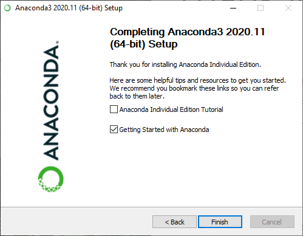
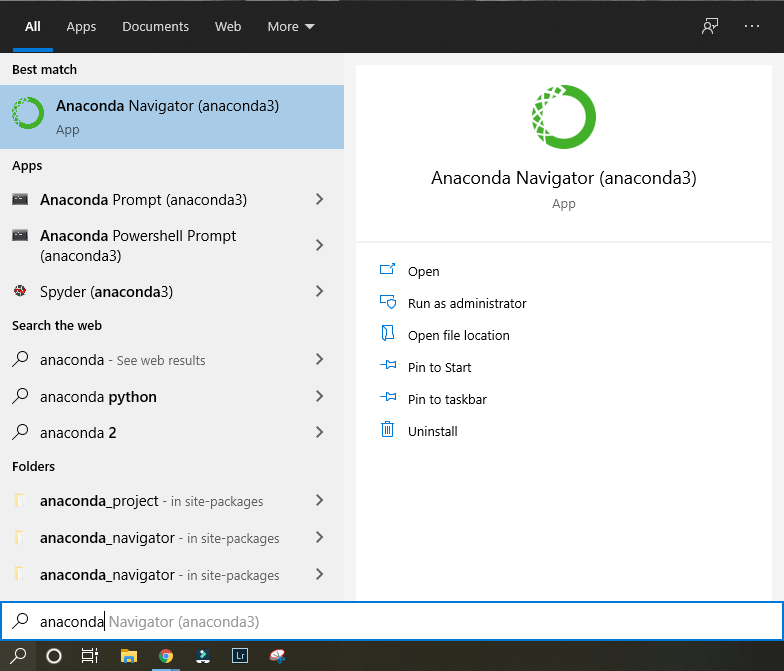
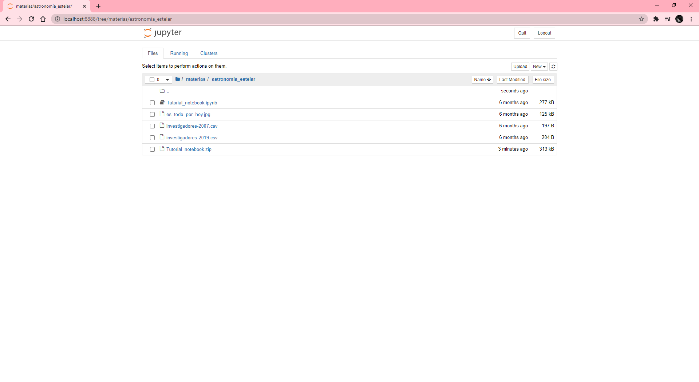

# Instrucciones de instalación

Hola! 
esta página contiene instrucciones para instalar **jupyter-notebook** en un entorno **CONDA**, para poder utilizar *python* directamente en un navegador. 

### ¿Qué vas a necesitar?

- Vas a necesitar una PC/notebook con Windows y al menos 3Gb de espacio libre.
- Un poco de paciencia

### Aquí va la receta
1- Descargar el entorno *Anaconda*, que permite mantener un sistema de archivos dentro de un mismo ambiente sin interferir en el resto del sistema operativo: https://www.anaconda.com/products/individual#windows

2- Ejecutar el instalador

3- Ahora, busquen dentro de los programas instalados, ANACONDA NAVIGATOR:

3- Creen un nuevo entorno usando el boton *create*, ubicado abajo a la izquierda:

4- Agreguen un nuevo **canal**:

5- Los canales que vamos a utilizar son: **astropy**, y **conda-forge**

6- Ahora viene la parte de instalación de paquetes. Indicando todos los paquetes disponibles,
comiencen a marcar los siguientes: matplotlib, pandas, astropy, specutils, lmfit, jupyter. Al finalizar,
apliquen los cambios con el botón **apply**, ubicado abajo a la derecha:

7- Ahora vuelvan a la solapa **HOME**. Verán que ahora esta en el ambiente **AEpracticas**, y clickeen el icono jupyter

8- Ahora vamos a hacer una prueba.
Descarguen el primer tutorial de la cátedra: LINK

