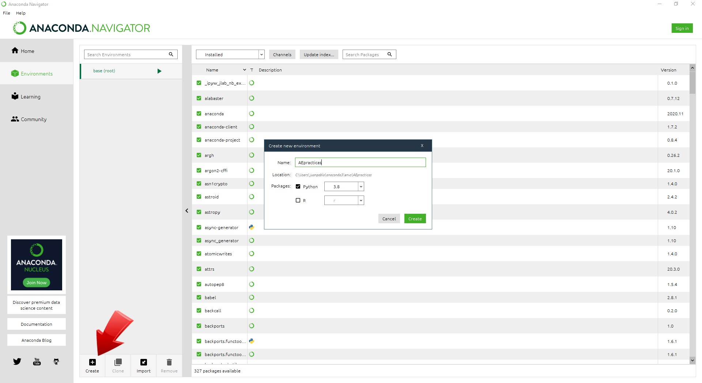
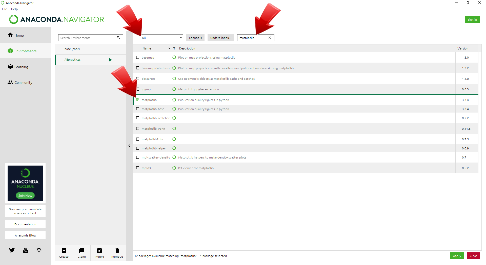
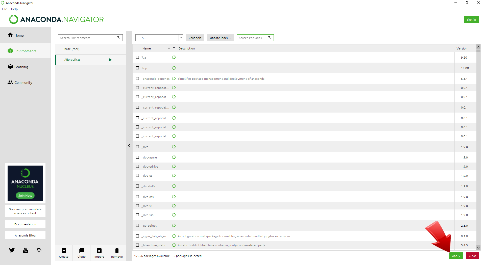
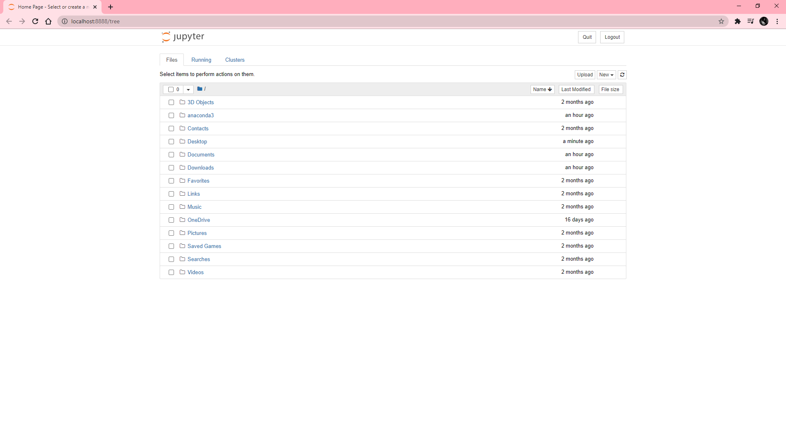

## Configuración del entorno de trabajo

Esta parte de la instalación, si hace mediante el **anaconda navigator**, es igual para todos los sistemas operativos

4- Creen un nuevo entorno usando el boton *create*, ubicado abajo a la izquierda:

5- Agreguen un nuevo **canal**:

6- Los canales que vamos a utilizar son: **astropy** y **conda-forge**

7- Ahora viene la parte de instalación de paquetes. Indicando todos los paquetes disponibles (**all**),
comiencen a marcar los siguientes: matplotlib, pandas, astropy, specutils, lmfit, jupyter. Al finalizar,
apliquen los cambios con el botón **apply**, ubicado abajo a la derecha:

8- Ahora vuelvan a la solapa **HOME**. Verán que ahora esta en el ambiente **AEpracticas**, y clickeen el icono jupyter

