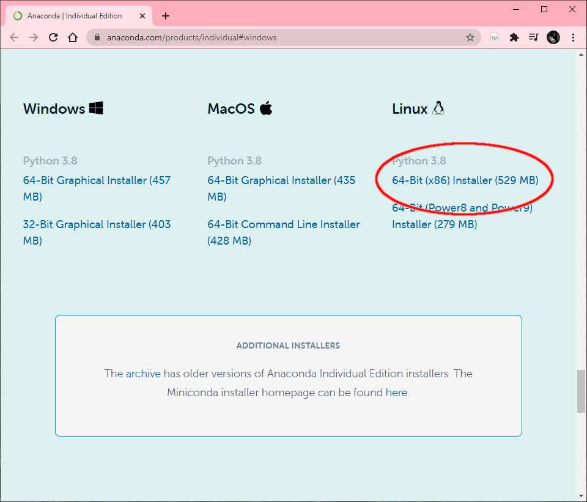

## Instalación en GNU/LINUX

1- Descargar el entorno Anaconda, que permite mantener un sistema de archivos dentro de un mismo ambiente sin interferir en el resto del sistema operativo: https://www.anaconda.com/products/individual#linux

<div>
<p align="center">

</p>
</div>

2- Instalar (como administradorx), los siguientes paquetes:

```apt-get install libgl1-mesa-glx libegl1-mesa libxrandr2 libxrandr2 libxss1 libxcursor1 libxcomposite1 libasound2 libxi6 libxtst6```

Son nesecarios para que funcione el entorno visual del anaconda.

Los siguientes comandos (3- a 5-) se ejecutan por unica vez:

3- Ejecutar el instalador: ```bash ~/Downloads/Anaconda3-2020.02-Linux-x86_64.sh```

4- Refrescar las variables de entorno: ```source ~/.bashrc```

5- Configurar conda para que no inicie cada vez que se abre una terminal: ```conda init && conda config --set auto_activate_base False```

6- Abrir una terminal nueva y ejecutar: ```conda activate && anaconda-navigator```

<div>
<p align="center">

</p>
</div>

---

Ahora podemos continuar con la configuración del entorno: [siguiente](configuracion-entorno.md)
