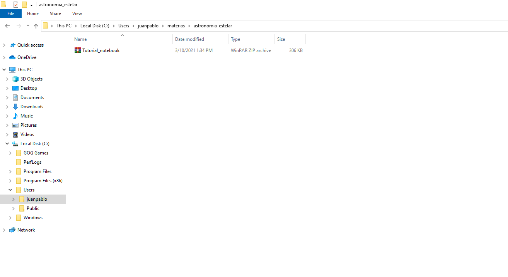
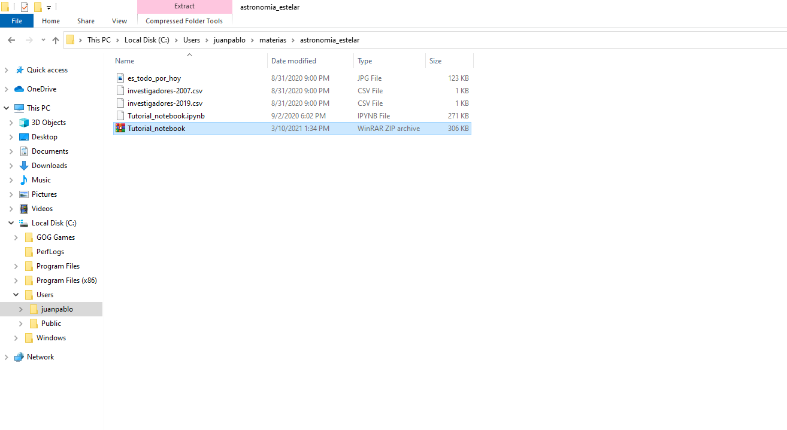

## Parte 2: Prueba del tutorial inicial de la cátedra

1- Ahora vamos a hacer una prueba. Descarguen el primer tutorial de la cátedra: [tutorial](https://github.com/JPCalderon/Astronomia-Estelar/blob/master/docs/Tutorial_notebook.zip), y descomprimanlo. 

2- Ahora, en la ventana de jupyter, busquen la carpeta que acaban de crear y seleccionen el archivo de extesion **ipynb**,
este corresponde al **notebook** del tutorial.

Listo! Si todo lo anterior funcionó significa que tienen **jupyter-notebook** funcionando.
