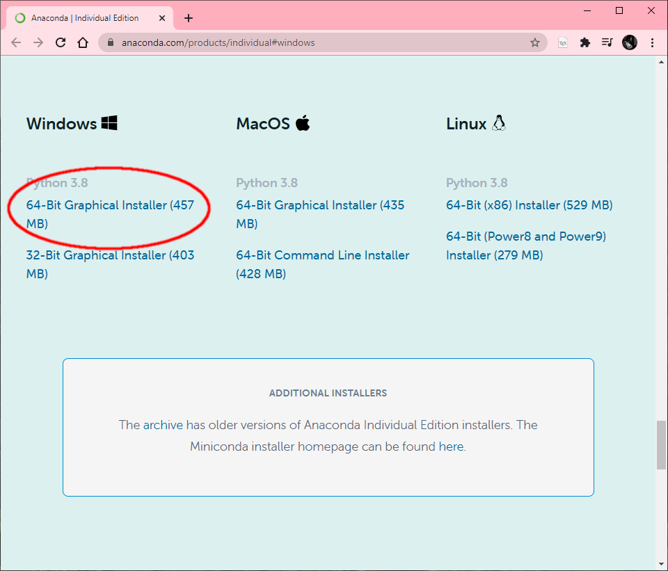

## Parte 1: Instalación en Windows

1- Descargar el entorno *Anaconda*, que permite mantener un sistema de archivos dentro de un mismo ambiente sin interferir en el resto del sistema operativo: https://www.anaconda.com/products/individual#windows

2- Ejecutar el instalador

3- Ahora, busquen dentro de los programas instalados, el programa **anaconda navigator**:

Pueden encontrar mas información sobre la instalacion aquí: https://docs.anaconda.com/anaconda/install/windows/

---

Ahora podemos continuar con la configuración del entorno: [siguiente](instalacion-configuracion.md)
